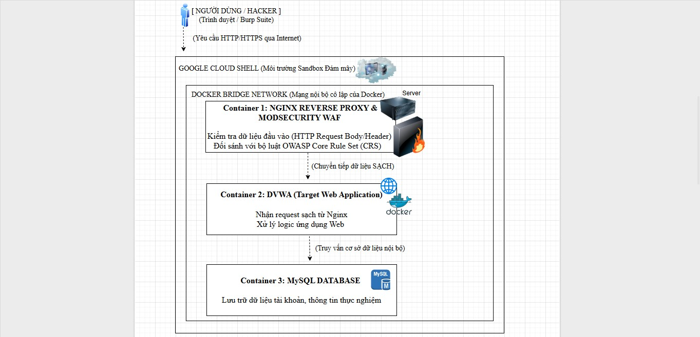
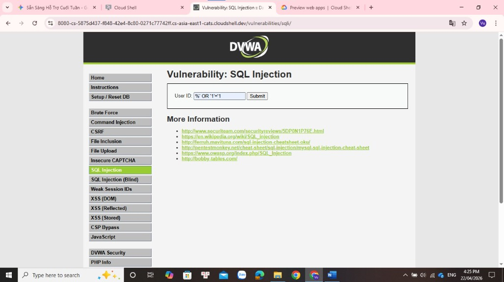
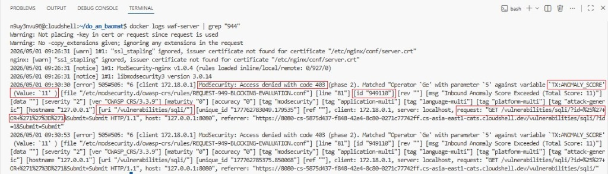
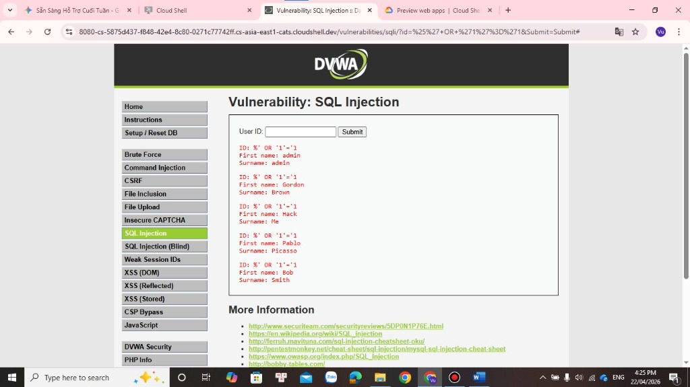

# 🛡️ Enterprise Web Application Firewall (WAF) & Security Lab

[](https://nguyenhtra43-sec.github.io/waf-security-lab/)
[](https://www.docker.com/)
[](https://nginx.org/)
[](https://modsecurity.org/)
[](https://coreruleset.org/)
[](https://www.python.org/)

Hệ thống phòng thủ Tường lửa ứng dụng web tầng Layer 7 (L7 WAF) kết hợp **Nginx Reverse Proxy**, **ModSecurity v3 Engine** và bộ quy tắc **OWASP Core Rule Set (CRS 3.3.10)** bảo vệ ứng dụng mục tiêu **DVWA (Damn Vulnerable Web Application)** trước các cuộc tấn công thuộc danh mục OWASP Top 10.

---

## 🌐 Trải Nghiệm Trực Tuyến (Interactive Live Demo)

👉 **Truy cập Giao diện Demo tương tác tại GitHub Pages:**  
**[https://nguyenhtra43-sec.github.io/waf-security-lab/](https://nguyenhtra43-sec.github.io/waf-security-lab/)**

* **Mô phỏng 3 kịch bản tấn công**: Thử nghiệm SQLi, XSS, Brute Force với công tắc BẬT/TẮT WAF theo thời gian thực.
* **Mô phỏng Terminal SOC**: Trực quan hóa log ModSecurity CRS với Anomaly Score và mã lỗi chặn 403 Forbidden.
* **Thư viện bằng chứng thực nghiệm**: Đối chiếu kết quả thu thập từ Google Cloud Shell.

---

## 📐 Kiến Trúc Hệ Thống (System Architecture)

Toàn bộ hệ thống được container hóa thông qua **Docker Compose**. Mọi luồng truy cập từ Internet hoặc Client đều phải đi qua Nginx Reverse Proxy tích hợp ModSecurity trước khi tới dịch vụ ứng dụng nội bộ DVWA.



### Quy trình kiểm soát 5 giai đoạn (ModSecurity 5-Phase Inspection):
1. **Phase 1 (Request Headers):** Phân tích HTTP Method, User-Agent, URI, Host, và Cookie bất thường.
2. **Phase 2 (Request Body - Core):** Quét sâu nội dung truy vấn GET/POST, so khớp regex và thư viện `libinjection` để phát hiện SQL Injection, XSS, Command Injection.
3. **Phase 3 (Response Headers):** Kiểm soát và ẩn các tiêu đề nhận diện máy chủ nội bộ.
4. **Phase 4 (Response Body):** Ngăn chặn rò rỉ thông điệp lỗi cơ sở dữ liệu hoặc dữ liệu nhạy cảm.
5. **Phase 5 (Audit Logging):** Ghi nhật ký vi phạm (`audit.log` / `error.log`) phục vụ phân tích điều tra số (DFIR / SOC).

---

## 🧪 3 Kịch Bản Tấn Công & Kết Quả Thực Nghiệm

| Kịch Bản Tấn Công | Vector / Payload Mẫu | Khi Chưa Có WAF (WAF OFF) | Khi Có WAF ModSecurity (WAF ON) | CRS Rule Kích Hoạt |
| :--- | :--- | :--- | :--- | :--- |
| **1. SQL Injection (SQLi)** | `%' OR '1'='1`<br>`' OR '1'='1` | **200 OK**<br>Toàn bộ danh sách người dùng (`admin`, `Gordon`, `Hack`, `Pablo`, `Bob`) bị rò rỉ. | **403 Forbidden**<br>Yêu cầu bị ngắt ngay tại Phase 2. Ghi nhận `Anomaly Score = 11` (Ngưỡng: 5). | **Rule 942100** (libinjection)<br>**Rule 942140**<br>**Rule 949110** (Score Exceeded) |
| **2. Cross-Site Scripting (XSS)** | `<script>alert(1)</script>`<br>`` | **200 OK**<br>Mã JavaScript thực thi trên trình duyệt, lấy cắp Cookie & session ID. | **403 Forbidden**<br>Chặn đứng vector script tag / event handler. | **Rule 941100**<br>**Rule 941110** |
| **3. Vét cạn (Brute Force)** | Tự động hóa đăng nhập liên tục (Burst > 10 req/5s) | **200 OK**<br>Quá trình thử mật khẩu tiếp diễn cho đến khi tìm thấy mật khẩu hợp lệ. | **403 Forbidden / 429**<br>Kích hoạt kiểm soát tần suất gửi yêu cầu và tạm khóa truy cập IP. | **Rule 912100** (DOS/Rate-Limit) |

---

## 📸 Bằng Chứng Thực Nghiệm Từ Google Cloud Shell

### 1. Nhập Payload SQLi vào form DVWA


### 2. ModSecurity ghi nhận Anomaly Score = 11 và Chặn đứng 403 Forbidden
```bash
n9uy3nvu96@cloudshell:~/do_an_baomat$ docker logs waf-server | grep "944"
[error] 505#505: *6 [client 172.18.0.1] ModSecurity: Access denied with code 403 (phase 2). 
Matched "Operator 'Ge' with parameter '5' against variable 'TX:ANOMALY_SCORE' (Value: '11' ) 
[file "/etc/modsecurity.d/owasp-crs/rules/REQUEST-949-BLOCKING-EVALUATION.conf"] [line "81"] [id "949110"] 
[msg "Inbound Anomaly Score Exceeded (Total Score: 11)"] 
[uri "/vulnerabilities/sqli/"] 
[request: "GET /vulnerabilities/sqli/?id=%2527+OR+%271%27%3D%271&Submit=Submit HTTP/1.1"]
```


### 3. Hậu quả khi không có WAF: Toàn bộ dữ liệu bị trích xuất


---

## 🚀 Hướng Dẫn Cài Đặt & Triển Khai (Quick Start)

### Yêu Cầu Tiên Quyết
* Đã cài đặt Docker và Docker Compose (hoặc tài khoản [Google Cloud Shell](https://shell.cloud.google.com/)).

### Bước 1: Clone kho lưu trữ
```bash
git clone https://github.com/nguyenhtra43-sec/waf-security-lab.git
cd waf-security-lab
```

### Bước 2: Khởi động hệ thống
```bash
docker-compose up -d
```
Kiểm tra trạng thái container:
```bash
docker ps
```
Truy cập giao diện ứng dụng tại: `http://localhost:8080` (hoặc cổng Web Preview trên Cloud Shell).

### Bước 3: Chạy kịch bản tự động kiểm tra bảo mật (Python)
```bash
python3 scripts/test_security.py
```
Kết quả kiểm tra mẫu:
```text
[+] Testing WAF Defense...
[SUCCESS] SQL Injection blocked (403 Forbidden)
[SUCCESS] XSS Attack blocked (403 Forbidden)
```

---

## 📁 Cấu Trúc Dự Án (Project Structure)

```text
waf-security-lab/
├── index.html                 # Giao diện Demo tương tác trực quan triển khai trên GitHub Pages
├── docker-compose.yml         # Bản thiết kế khởi tạo cụm Nginx WAF và ứng dụng DVWA
├── Dockerfile                 # Đóng gói container WAF ModSecurity CRS
├── config/
│   └── nginx.conf             # Cấu hình Reverse Proxy Nginx & nạp ModSecurity
├── scripts/
│   └── test_security.py       # Script Python tự động kiểm thử SQLi, XSS
├── images/
│   ├── architecture.jpg       # Sơ đồ kiến trúc hệ thống
│   ├── sqli_test.jpg          # Ảnh thực nghiệm nhập payload SQLi
│   ├── modsec_log_403.jpg     # Ảnh log ModSecurity bắt vi phạm 403
│   └── sqli_vulnerable_dump.jpg # Ảnh rò rỉ dữ liệu khi tắt WAF
├── .gitignore                 # Loại bỏ tệp tạm, nhạy cảm
└── README.md                  # Tài liệu hướng dẫn & mô tả dự án
```

---

## 👤 Tác Giả & Liên Hệ (Author)

* **Tác giả:** Nguyễn Hương Trà
* **GitHub:** [@nguyenhtra43-sec](https://github.com/nguyenhtra43-sec)
* **Email:** [nguyenhtra43@gmail.com](mailto:nguyenhtra43@gmail.com)
* **Dự án:** [https://github.com/nguyenhtra43-sec/waf-security-lab](https://github.com/nguyenhtra43-sec/waf-security-lab)
* **Live Demo:** [https://nguyenhtra43-sec.github.io/waf-security-lab/](https://nguyenhtra43-sec.github.io/waf-security-lab/)
